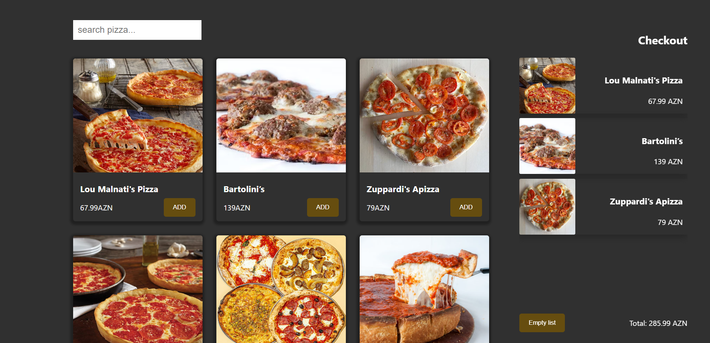

Pizza App
> react-pizaa-app

[![NPM Version][npm-image]][npm-url]
[![Build Status][travis-image]][travis-url]
[![Downloads Stats][npm-downloads]][npm-url]

A short app for searching and calculating popular pizzas.



## Development setup

```sh
npm i
npm run dev
```
Local:   http://localhost:5173/

➜  press h to show help

  Shortcuts
 - press r to restart the server
 - press u to show server url
 - press o to open in browser
 - press c to clear console
 - press q to quit

## Meta

 Nijat Gurbanov

- Github: [@NikoFX](https://github.com/NikoFX)
- Twitter: [@NikoFX](https://twitter.com/raminmammadzada)
- Linkedin: [Nijat Gurbanov](https://www.linkedin.com/in/nijatgurbanov-dev/)

Nijat Gurbanov – [@YourTwitter](https://twitter.com/dbader_org) – nijat

Distributed under the XYZ license. See ``LICENSE`` for more information.


## Contributing

1. Fork it (<https://github.com/yourname/yourproject/fork>)
2. Create your feature branch (`git checkout -b feature/fooBar`)
3. Commit your changes (`git commit -am 'Add some fooBar'`)
4. Push to the branch (`git push origin feature/fooBar`)
5. Create a new Pull Request

<!-- Markdown link & img dfn's -->
[npm-image]: https://img.shields.io/npm/v/datadog-metrics.svg?style=flat-square
[npm-url]: https://npmjs.org/package/datadog-metrics
[npm-downloads]: https://img.shields.io/npm/dm/datadog-metrics.svg?style=flat-square
[travis-image]: https://img.shields.io/travis/dbader/node-datadog-metrics/master.svg?style=flat-square
[travis-url]: https://travis-ci.org/dbader/node-datadog-metrics
[wiki]: https://github.com/yourname/yourproject/wiki
